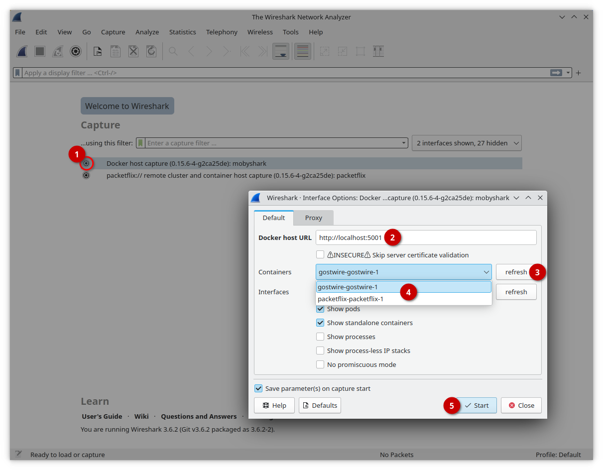

# Containershark Extcap Plugin for Wireshark

Take a deep dive into your container host virtual networking, even if it's in a
remote location. No fiddling with special containers and juggling error-prone
CLI Docker commands. Simply click on a "fin" capture button inside one of the
containers in Ghostwire's web UI to start a Wireshark live capture session:

Confirm and we're live capturing.

## What You See Is What You Get

- Capture network traffic _live_ from your containers (and pods), straight into
  your Desktop Wireshark on _Linux_ and _Windows_.

- Capture from any container _without_ preparing or modifying it for capturing.
  Just go capturing.

- Supports stand-alone container hosts, including the Siemens Industrial Edge.

- Remotely capture not only from containers, but also from the container host
  itself, process-less network namespaces, et cetera.

- this Wireshark plugin can be build for Windows 64bit (x86) as well as Linux
  64bit (x86, ARM). Currently, we support the .apk, .deb, and .rpm package
  formats on Linux.

## Project Map

The Containershark extcap plugin is part of the "Edgeshark" project that consist
of several repositories:
- [Edgeshark Hub repository](https://github.com/siemens/edgeshark)
- [G(h)ostwire discovery service](https://github.com/siemens/ghostwire)
- [Packetflix packet streaming service](https://github.com/siemens/packetflix)
- 🖝 **Containershark Extcap plugin for Wireshark** 🖜
- support modules:
  - [csharg (CLI)](https://github.com/siemens/csharg)
  - [mobydig](https://github.com/siemens/mobydig)
  - [ieddata](https://github.com/siemens/ieddata)

## Quick Start

Please deploy the [G(h)ostwire discovery
service](https://github.com/siemens/ghostwire) and [Packetflix packet streaming
service](https://github.com/siemens/packetflix) on your Docker host.

Then install this plugin: on Windows download and install the cshargextcap
installer artifact. On Linux, download and install the cshargextcap package for
your distribution (apk, deb, or rpm). In case you want to create the
installation files yourself, then simply run `make dist` in the base directory
of this repository. Afterwards, installation files will be found in the `dist/`
directory.

Now fire up Wireshark. If the installation went through correctly, Wireshark now
should show two new "interfaces", as shown below: 

It's as easy as this:

1. click the ⚙ _gear icon_ next to the network interface named "Docker host
   capture".
2. enter your Docker host's IP address or DNS name, as well as port `:5001` into
   the field "Docker host URL".
3. click the _refresh_ button to get the list of available pods (and more...).
4. pick your container.
5. click the _Start_ button.

...and your live capture starts immediately.

> **🛈** Wireshark creates the UI for our capture plugin and unfortunately we're
> therefore (quite) limited to what Wireshark has on offer. Please don't create
> UI/UX feature requests as we don't have any control over Wireshark's UI – with
> the exception of our _own_ bugs: please create issues for them in this
> project's issue tracker.

Please find more details in our [csharg Extcap ⚙ Plugin Manual](docs/manual.md).

Finally, there's also some technical background information in our
[csharg ⚙ Plugin Technical Details](docs/technical.md).

# Contributing

Please see [CONTRIBUTING.md](CONTRIBUTING.md).

## License and Copyright

(c) Siemens AG 2023

[SPDX-License-Identifier: MIT](LICENSE)
