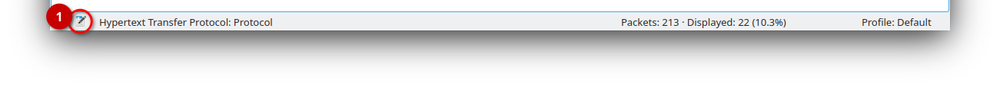

# Capturing from Standalone Container Hosts

1. Click on the **⚙/"gear" icon** next to **"Docker host capture"** in the list
   of available network interfaces. This brings up the configuration dialog for
   capturing a standalone container host.

   > **⚠** **DO NOT DOUBLE CLICK ON THE NETWORK INTERFACE TEXT.** This will
   > _restart_ instead the previous capture, and since there wasn't one yet, it
   > will fail.

   

2. **enter the URL** of your container host, an URL in the form of
     http://&lt;ip-address>:5001 for a default deployment on port 5001 (note
     HTTP, not HTTPS).

3. **click the _refresh_ button** in order to fetch or update the list of the
   available containers on this host. This will list _all_ containers, even
   those from Docker-in-Docker and Docker-side-by-side-Docker setups.

   > 🛈 _Due to the UI restrictions for Wireshark extcap plugins we cannot
   > automatically update the list of containers automatically._

4. **choose your container** from the _Containers_ drop-down list.

5. **click the _Start_ button** to start the remote packet capture from your
   pod.

Wireshark will now switch into its main view and connect to your container host
in the background. You should then see live packets flowing in as soon as they
are captured from your container.

## Capture File Properties: Container Details

An innovative new feature of Containershark is including information about the
source of the capture into your packet captures, which will be stored also in
your capture files. This is something that to our knowledge no capture tool
currently supports, except for Containershark. These details are:

- name of container and type of container,
- container host name ("node name") where the container is running.

To see this information, click on the "notebook" icon in Wireshark's status bar.

This will open the (probably rather lesser-known) _Capture File Properties_
dialog. In the bottom part of this dialog, you'll find the new information added
to the _Capture file comments_.

## More Capture Configuration

The capture configuration dialog has some more things on offer: filtering the
list of "containers" to show only containers, processes with virtual IP stacks,
et cetera. Or avoiding promiscuous mode when capturing.

### Filter Pod/Container List

You can filter the list of "containers" for different types of _things_ having
their own virtual IP stacks. The "pod" filter option works great when working
with [KinD](https://github.com/kubernetes-sigs/kind) test deployments.

1. **pods:** show pods by namespace/name, as opposed to individual containers.
   When capturing from a standalone container host, this defaults to "off".
   However, there are special use cases where switching showing pods on actually
   makes sense, such as when working locally on an headless Kubernetes node, et
   cetera.
2. **standalone containers:** shows containers **which are not part of a pod**
   (Docker, containerd, ...). This defaults to "on" when capturing from
   standalone container hosts.
3. **processes:** shows processes with their own virtual IP stacks (Linux
   network namespaces), which are neither inside pods nor containers. Defaults
   to "off".
4. **process-less IP stacks:** a fancy name for Linux network namespaces without
   any process attached to them. Defaults to "off".

### Promi(scuous) Mode

By default, when capturing the network interfaces included in a capture will be
placed into promiscuous mode for the time of the capture.

1. **no promiscuous mode:** check when you don't _need_ promiscuous mode when
   capturing.

> **⚠**️ Disabling promiscuous mode cannot be _enforced_, but only _requested_.
> If for some reason (such as another parallel capture or system configuration)
> a network interface is already in promiscuous mode, then it will stay in this
> mode, even with the option checked in the configuration dialog.

## Proxy Setup

Unless you really need to traverse a (company) proxy in order to connect to your
container host, there's a good reason to go with the default settings out of the
box to minimize proxies breaking things: "Disable proxies" is ticked.

1. **Disable proxies** simply means: ignore any system settings and directly
   connect to the container host services. In particular, don't let system-wide
   proxy configuration interfere with your proper local setup.

   Untick _Disable proxies_ only when you need to access remote container hosts
   via (company) proxies. Make sure that your (company) proxies correctly support Websocket operations.

2. If you don't fill in any information here, then the system/user settings will
   be taken.
   
   You can selectively override the system/user proxy settings by filling in the
   empty input fields with the required information.

   > **⚠** The Golang HTTP/Websocket libraries we must rely on currently on
   > Windows only take notice the proxy environment variables on Windows, but
   > not of any registry settings.
