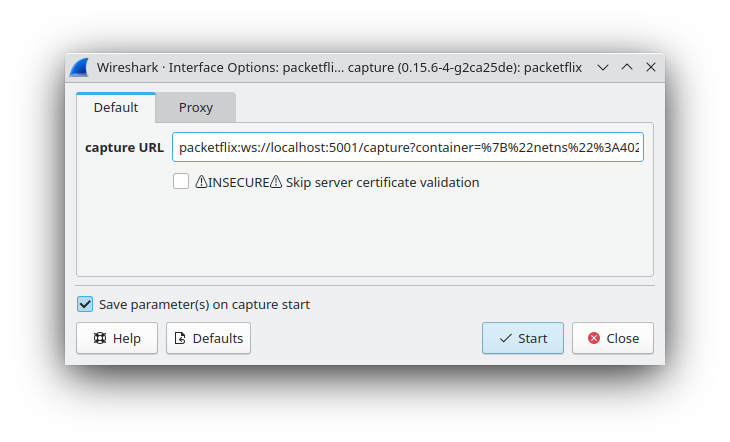
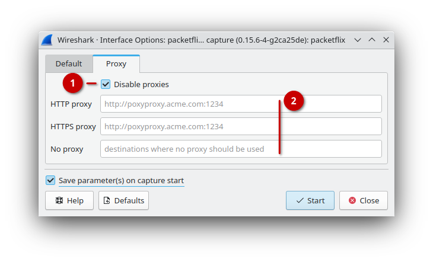

# Capturing via `packetflix:` URLs

The primary use for this external capture network interface is to click on a
capture link in your web browser ... which then hands over to Wireshark. Thus,
users typically won't interact directly with this specific network interface.

The only interesting parameter here is a `packetflix:` URL. It's a new URL
scheme registered to start Wireshark and then trigger this external capture
plugin. When installing the ClusterShark extcap plugin via its Windows
installer, then the necessary system registration will be done automatically.

> **🛈** A `packetflix:` URL addresses a capture service and specifies the
> information necessary to capture from a (set of) network interface(s) inside a
> pod, container, et cetera.

## Proxy Setup

Unless you really need to traverse a (company) proxy in order to connect to your
container host, stay with the default settings out of the box: "Disable proxies"
is ticked.

1. **Disable proxies** simply means: ignore any system settings and directly
   connect to the container host services. In particular, don't let system-wide
   proxy configuration interfere with your proper local setup.

   Untick _Disable proxies_ only when you need to access remote container hosts
   via (company) proxies. Make sure that your (company) proxies correctly support Websocket operations.

2. If you don't fill in any information here, then the system/user settings will
   be taken.
   
   You can selectively override the system/user proxy settings by filling in the
   empty input fields with the required information.

   > **⚠** The Golang HTTP/Websocket libraries we must rely on currently on
   > Windows only take notice the proxy environment variables on Windows, but
   > not of any registry settings.
