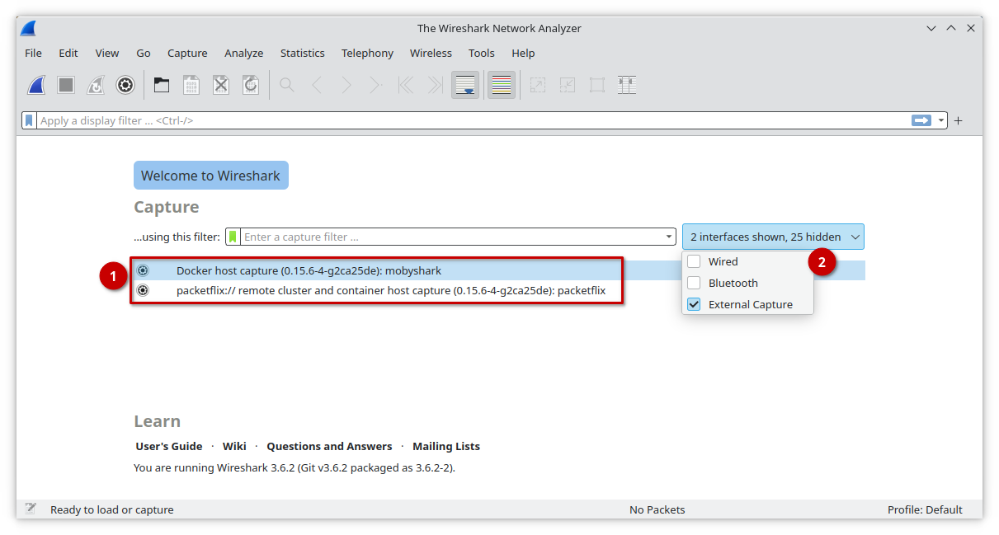

# Containershark Extcap Plugin Manual

The next time you start Wireshark after you've installed the Containershark
("cshargextcap") plugin, you should now see _two_ new network interfaces
appearing in the list of available network interfaces ➊. These "pseudo"
interfaces act as _portals_ to a potentially large number of containers even on
stand-alone hosts.

Depending on from which kind of container system you want to capture from,
please follow one of the following links for the concrete desription about
capturing:

- [Container (Docker) host capture](manual-containerhost.md), such as the Industrial Edge.
- [Packetflix URL capture](manual-url.md).

> In case you don't see these interfaces:
> 1. make sure that in the drop-down selector "x interfaces shown, x hidden" ➋
>    you've enabled "External Capture" network interfaces.
> 2. check that you've successfully downloaded the correct plugin binary for
>    your platform and that you've installed it in the correct place. Ensure
>    that the binary is marked as "executable" on Linux.

## UI Note

Due to the design of Wireshark's API with external capture plugins it is not
possible to list all available containers or pods in Wireshark's interface list
right on start. Also, this would slow down startup massively. Finally, the
Wireshark user interface lacks any dynamic filtering or search means, so we
unfortunately cannot offer such UX features.
