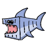

[](https://github.com/siemens)
[](https://github.com/industrial-edge)
[](https://github.com/siemens/edgeshark)

# Containershark ⚙ Plugin Technical Details

Please️ note that function names such as `ExtcapConfigure` are high-level
functions of the extcap pluging. These then rely on
[csharg](https://github.com/siemens/csharg) library functions for the dirty
work.

## Wireshark Startup

When Wireshark starts, it looks into its `extcap` directories (system-wide and
per user) searching for plugin executables, which it then starts one after
another in order to gather information:

- the network interfaces provided by these extcap plugins,
- the UI configuration parameters used by these plugins,
- and finally the data link layer encapsulation used by these network interfaces.

The important takeaway here is that extcap plugins are very "_RESTless_" because
Wireshark calls them _multiple_ times. This does not exactly improve performance
due to having to initialize multiple times. However, the compiled code and the
Go runtime do a well performing job here in our experience, so this issue is
mitigated to a good extend.

```plantuml
hide footbox

actor user
boundary Wireshark
participant cshargextcap <<extcap plugin>>

' user starts Wireshark
user -> Wireshark : start
create Wireshark

' Wireshark asks cshargextcap for network interfaces
create cshargextcap
Wireshark -> cshargextcap : ""--""extcap-interfaces
activate cshargextcap
    cshargextcap -> cshargextcap : ExtcapInterfaces
    activate cshargextcap
    deactivate cshargextcap
return
destroy cshargextcap
note over cshargextcap
    supported version, help URL:
        ""extcap {version=...}{help=...}""
    list of "network interfaces":
        ""interface {value=mobyshark}{display=...}""
        ""interface ...""
end note

|||
' Wireshark asks cshargextcap about details for a specific network interface
create cshargextcap
Wireshark -> cshargextcap : ""--""extcap-config ""--""extcap-interface mobyshark
activate cshargextcap
    cshargextcap -> cshargextcap : ExtcapConfigure
    activate cshargextcap
        cshargextcap -> cshargextcap : MobyNif.Configure
        activate cshargextcap
        deactivate cshargextcap
    deactivate cshargextcap
return
destroy cshargextcap
note over cshargextcap
    list of config UI arguments:
        ""arg {number=...}...""
end note

|||
' Wireshark asks cshargextcap about DLTS for a specific network interface
create cshargextcap
Wireshark -> cshargextcap : ""--""extcap-dlts ""--""extcap-interface mobyshark
activate cshargextcap
    cshargextcap -> cshargextcap : ExtcapDlts
    activate cshargextcap
    deactivate cshargextcap
return
destroy cshargextcap
note over cshargextcap
    ""dlt {number=147}{name=...}{display=...}""
end note

```

## Interface Configuration

The user clicks on the gear icon next to an extcap plugin network interface.
And yes, Wireshark asks for the UI configuration parameters _again_. Then, the
user presses a "reload" button in order to update, for instance, the list of
containers.

To simplify single-host service configuration the plugin only talks to the
Packetflix service on a standalone container host, and Packetflix implements a
forwarding path to reach the associated Ghostwire service instance.

```plantuml
hide footbox

actor user
boundary Wireshark
participant cshargextcap <<extcap plugin>>
entity Ghostwire <<service>>
entity Packetflix <<service>>

' user configures extcap network interface
user -> Wireshark : configure

' Wireshark asks cshargextcap about details for a specific network interface
create cshargextcap
Wireshark -> cshargextcap : ""--""extcap-config\n""--""extcap-interface mobyshark
activate cshargextcap
    cshargextcap -> cshargextcap : MobyNif.Configure
    activate cshargextcap
    deactivate cshargextcap
return
destroy cshargextcap
note over cshargextcap
    list of config UI arguments:
        ""arg {number=...}...""
end note

|||
' user presses reload button
user -> Wireshark : reload (containers)

' Wireshark asks cshargextcap about details for a specific network interface
create cshargextcap
Wireshark -> cshargextcap : ""--""extcap-config\n""--""extcap-interface mobyshark\n""--""extcap-reload-option container
activate cshargextcap
    cshargextcap -> cshargextcap : ExtcapReloadOption
    activate cshargextcap
        cshargextcap -> cshargextcap : MobyNif.ReloadOption
        activate cshargextcap
            cshargextcap -> Packetflix : GET /discover/mobyshark
            activate Packetflix
                Packetflix -> Ghostwire : GET /mobyshark
                activate Ghostwire
                    return
                return
        deactivate cshargextcap
    deactivate cshargextcap
return
destroy cshargextcap
note over cshargextcap
    list of config UI values, Wireshark only accepts values
    for the ""arg {number=...}"" whose "reload" button was
    pressed, other ""value {number=...}"" will be ignored:
        ""value {number=...}...""
end note
```

## Capture from Paketflix Service via External Capture Plugin

After all the hassle, let's capture packets. Here's the basic picture – where
we've left out all the complex details about updating the toolbar and statusbar,
and then even more.

```plantuml
hide footbox

actor user
boundary Wireshark
participant cshargextcap <<extcap plugin>>
entity Ghostwire <<service>>
entity Packetflix <<service>>

' user presses Start button
user -> Wireshark : start (capture)

create cshargextcap
Wireshark -> cshargextcap : ""--""capture\n""--""extcap-interface mobyshark\n""--""fifo ...
activate cshargextcap
    Wireshark <- cshargextcap : fifo.open('wb')
    cshargextcap -> Packetflix : ws://... GET /capture?...
    activate Packetflix
        cshargextcap <- Packetflix : connected
        group stream packet capture data
            loop
                cshargextcap <- Packetflix : message(data)
                Wireshark <- cshargextcap : fifo.write(data)
            end
        else stop (capture)
            user -> Wireshark : stop
            Wireshark -> Wireshark : fifo.close
            Wireshark -\ cshargextcap : fifo closed
            cshargextcap -> Packetflix : close
        end
        return closed
    deactivate Packetflix
deactivate cshargextcap
destroy cshargextcap
```
